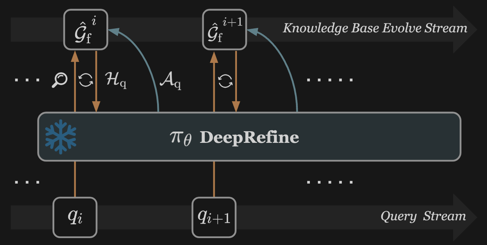

<div align="center">

# DeepRefine-Skill

<table style="border: none; margin: 0 auto; padding: 0; border-collapse: collapse;">
<tr>
<td align="center" style="vertical-align: middle; padding: 10px; border: none; width: 250px;">
  
</td>
<td align="left" style="vertical-align: middle; padding: 10px 0 10px 30px; border: none;">
  <pre style="font-family: 'Courier New', monospace; font-size: 16px; color: #0EA5E9; margin: 0; padding: 0; text-shadow: 0 0 10px #0EA5E9, 0 0 20px rgba(14,165,233,0.5); line-height: 1.2; transform: skew(-1deg, 0deg); display: block;">██████╗ ███████╗███████╗██████╗ ██████╗ ███████╗███████╗██╗███╗   ██╗███████╗
██╔══██╗██╔════╝██╔════╝██╔══██╗██╔══██╗██╔════╝██╔════╝██║████╗  ██║██╔════╝
██║  ██║█████╗  █████╗  ██████╔╝██████╔╝█████╗  █████╗  ██║██╔██╗ ██║█████╗  
██║  ██║██╔══╝  ██╔══╝  ██╔═══╝ ██╔══██╗██╔══╝  ██╔══╝  ██║██║╚██╗██║██╔══╝  
██████╔╝███████╗███████╗██║     ██║  ██║███████╗██║     ██║██║ ╚████║███████╗
╚═════╝ ╚══════╝╚══════╝╚═╝     ╚═╝  ╚═╝╚══════╝╚═╝     ╚═╝╚═╝  ╚═══╝╚══════╝</pre>
</td>
</tr>
</table>

[](https://pypi.org/project/deeprefine-cli/0.1.7/)
[](https://pypi.org/project/deeprefine-cli/0.1.7/)
[](https://arxiv.org/pdf/2605.10488)
[](https://github.com/HKUST-KnowComp/DeepRefine)



</div>

DeepRefine-Skill plugs into agent workflows and use a single command `/deeprefine` in your agent CLI to refine and evolve your LLM-Wiki (e.g., **[graphify](https://github.com/safishamsi/graphify)**) knowledge base.

```bash
/deeprefine
```

<<<<<<< Updated upstream
**Typical flow:** `graphify .` → `graphify query "..."` → `/deeprefine`.

---

## Two refinement modes

| | **Agent mode** (default) | **CLI mode** |
|---|--------------------------|--------------|
| **Trigger** | Cursor `/deeprefine` | `deeprefine refine` |
| **Core loop** | Same control flow as `Reafiner.refine()` | Full `Reafiner` in DeepRefine |
| **Retrieval source** | `graphify query` + k-hop expansion from `graph.json` | FAISS + embedding index |
| **LLM runtime** | Your current assistant session model | vLLM or API (`DEEPREFINE_*`) |
| **Extra setup** | `pip install deeprefine-cli` only | DeepRefine repo + `atlastune` + API/vLLM |
=======
It refines your graphify knowledge graph for better future retrieval and Q&A quality.
>>>>>>> Stashed changes

---

## News
- **[2026/6/15] v0.1.8** - Aligned interaction memory with LLM-Wiki (graphify) and fixed the single query refinement issue.
- **[2026/6/2] v0.1.7** — Cursor skill + `deeprefine refine` with configurable API. And strict DeepRefine agent loop.

## Agent CLI (Recommended)

<<<<<<< Updated upstream
## Quick start (Agent mode: recommended)

| Step | What |
|:----:|------|
| 1 | `pip install deeprefine-cli` |
| 2 | Run `deeprefine cursor install` at your KB project root |
| 3 | Build and query your graph (`graphify .`, then `graphify query "..."`) |
| 4 | In Cursor chat, run `/deeprefine` |
=======
This is the default mode and the main workflow for this project.

### Why Agent CLI first

- Uses your current Cursor session model (no separate API/vLLM setup required)
- Follows the same control flow as `Reafiner.refine()`
- Integrates with graphify query memory automatically
- Handles pending queries in batch, one by one

### One-time setup
>>>>>>> Stashed changes

```bash
pip install deeprefine-cli graphifyy

cd /path/to/your-kb-project
graphify cursor install
deeprefine cursor install
```

After upgrading the package, run `deeprefine cursor install` again to refresh local skill files.

### Typical session (Agent CLI)

```bash
/graphify .
./graphify ./ --wiki
/graphify query "your question"
/deeprefine
```

<<<<<<< Updated upstream
No `history add` is required for `/deeprefine` — the agent path records results via `deeprefine loop finish`.
=======
### What `/deeprefine` does now (default queue behavior)

When you run `/deeprefine`, it should follow this order:

1. `deeprefine history sync-memory`
   - import queries from `graphify-out/memory/query_*.md`
   - write to `graphify-out/.deeprefine/history.jsonl`
2. load pending queries from `history.jsonl` (`refined != true`)
3. refine all pending queries sequentially
4. mark each finished query as refined via `deeprefine loop finish`


### Agent artifacts

```text
graphify-out/
├── graph.json                              # graphify main graph (refined in-place)
├── memory/
│   └── query_*.md                          # graphify query logs (sync source)
└── .deeprefine/
    ├── history.jsonl                       # DeepRefine-maintained history queue
    ├── graph.json.bak                      # backup before first apply in this run
    ├── loop_trace_<query_id>.json          # per-query loop audit trace
    ├── refinement_results_<YYYYMMDD>.jsonl # per-day run log
    └── refinement_actions_*.txt            # optional; only when refinement path is taken
```

### Agent-related commands

Run from your KB project root.

| Command | Description |
|---------|-------------|
| `deeprefine cursor install` | Install `/deeprefine` skill into current project |
| `deeprefine cursor install --user` | Install skill for all projects (`~/.cursor/skills/`) |
| `deeprefine history sync-memory` | Import `graphify-out/memory/query_*.md` into DeepRefine history |
| `deeprefine history list --pending` | Show unrefined queue |
| `deeprefine loop init --query "..."` | Create `loop_trace_<id>.json` template |
| `deeprefine loop validate --trace-file T` | Validate trace against Reafiner control flow |
| `deeprefine apply --trace-file T --refinement-file F` | Apply `<refinement>` actions to `graph.json` |
| `deeprefine loop finish --trace-file T [--refinement-file F]` | Persist results and mark history refined |
>>>>>>> Stashed changes

---

## Terminal CLI (FAISS + API/vLLM)

<<<<<<< Updated upstream
Use this mode for terminal-only workflows. It requires [DeepRefine](https://github.com/HKUST-KnowComp/DeepRefine) in `atlastune` and an inference backend (API or vLLM).
=======
Use this section when you want a pure terminal workflow without Cursor `/deeprefine`.

### Extra requirements

- DeepRefine repository installed in `atlastune`
- Inference backend configured (API or vLLM)
>>>>>>> Stashed changes

```bash
conda activate atlastune
cd /path/to/DeepRefine && pip install -e .
pip install deeprefine-cli

<<<<<<< Updated upstream
cd /path/to/your-kb-project
deeprefine cursor install   # optional

# API (example)
export DEEPREFINE_LLM_URL=https://your-provider/v1
export DEEPREFINE_EMBED_URL=https://your-provider/v1
export DEEPREFINE_LLM_API_KEY=...
export DEEPREFINE_EMBED_API_KEY=...
export DEEPREFINE_MODEL=your-llm-model
export DEEPREFINE_EMBED_MODEL=text-embedding-3-small

# OR local vLLM (from DeepRefine repo)
# bash /path/to/DeepRefine/scripts/vllm_serve/qwen3-0.6b-emb.sh
# bash /path/to/DeepRefine/scripts/vllm_serve/qwen3-8b-vllm-reafiner.sh

deeprefine history add --query "your question"
deeprefine refine
```

---

## Pipeline

```text
  project files
        │
        ▼ graphify
   graph.json ◄──────────────────────────────┐
        │                                    │
        ▼ graphify query "..."               │
   (session Q&A)                             │
        │                                    │
        └─► deeprefine refine ───────────────┘
        │
        ▼ graphify query "..."
```

DeepRefine does not build the graph itself; it patches `graph.json` so subsequent `graphify query` calls retrieve better evidence.

---

## Artifacts

```text
graphify-out/
├── graph.json
└── .deeprefine/
    ├── history.jsonl              # query history (CLI refine / loop finish)
    ├── loop_trace_<query_id>.json # agent loop audit (required for apply)
    ├── refinement_actions_*.txt   # <refinement> block from agent
    ├── refinement_results_*.jsonl # run logs
    ├── graph.json.bak             # backup before apply/refine
    └── cache/reafiner.pkl         # FAISS cache (CLI mode only)
```

---

## Installation

### CLI package

| Method | Command |
|--------|---------|
| **PyPI** | `pip install deeprefine-cli==0.1.7` |
| **Source** | `pip install -e /path/to/DeepRefine-Skill` |

```bash
deeprefine --help
# Expect: cursor, history, index, refine, apply, loop
```

### Cursor skill

At **KB project root**:

| Command | Scope |
|---------|-------|
| `deeprefine cursor install` | `.cursor/skills/` (this project) |
| `deeprefine cursor install --user` | `~/.cursor/skills/` (all projects) |
| `deeprefine install` | alias for `cursor install` |

After upgrading the package, re-run `deeprefine cursor install` to refresh the local skill files.

### DeepRefine repo (CLI mode only)

```bash
conda activate atlastune
cd /path/to/DeepRefine && pip install -e .
# optional if not ../DeepRefine:
=======
# Optional, if DeepRefine repo is elsewhere
>>>>>>> Stashed changes
export DEEPREFINE_REPO=/path/to/DeepRefine
```

### Inference environment (CLI mode)

| Variable | Default |
|----------|---------|
| `DEEPREFINE_LLM_URL` | *(empty; SDK default)* |
| `DEEPREFINE_EMBED_URL` | *(empty; SDK default)* |
| `DEEPREFINE_API_KEY` | fallback to `OPENAI_API_KEY` |
| `DEEPREFINE_LLM_API_KEY` | fallback to `DEEPREFINE_API_KEY` |
| `DEEPREFINE_EMBED_API_KEY` | fallback to `DEEPREFINE_API_KEY` |
| `DEEPREFINE_MODEL` | `gpt-4.1-mini` |
| `DEEPREFINE_EMBED_MODEL` | `text-embedding-3-small` |

<<<<<<< Updated upstream
---

## Commands

Run commands from your **KB project root** (the directory containing `graphify-out/graph.json`).

### Agent loop

| Command | Description |
|---------|-------------|
| `deeprefine loop init --query "..."` | Create a `loop_trace_<id>.json` template |
| `deeprefine loop validate --trace-file T` | Validate the trace against `Reafiner.refine()` |
| `deeprefine loop finish --trace-file T` | Persist loop results and mark `history.jsonl` as refined |
| `deeprefine apply --trace-file T --refinement-file F` | Apply `<refinement>` actions to `graph.json` |

### CLI refine (FAISS)

| Command | Description |
|---------|-------------|
| `deeprefine history add --query "..."` | Record a query into history |
| `deeprefine history list` | List history |
| `deeprefine history list --pending` | Unrefined only |
| `deeprefine refine` | Refine all pending |
| `deeprefine refine --query "..."` | Refine one query |
| `deeprefine refine --rebuild-index` | Rebuild FAISS first |
| `deeprefine index --rebuild` | Rebuild FAISS cache only |

### Cursor

| Command | Description |
|---------|-------------|
| `deeprefine cursor install \| uninstall` | Manage `/deeprefine` skill |

---

## Workflow with graphify

**One-time**
=======
### Terminal workflow
>>>>>>> Stashed changes

```bash
cd /path/to/your-kb-project

# Option A: import from graphify memory first (recommended)
deeprefine history sync-memory
deeprefine history list --pending
deeprefine refine

# Option B: add one explicit query
deeprefine history add --query "your question"
deeprefine refine
```

### Terminal commands

<<<<<<< Updated upstream
| # | Action |
|:-:|--------|
| 1 | `graphify .` → `graphify-out/graph.json` |
| 2 | `graphify query "..."` |
| 3 | `/deeprefine` in Cursor *(recommended)* |
| 4 | *(optional)* `graphify query "..."` to verify |

**Terminal-only alternative:** `deeprefine history add` → `deeprefine refine` (requires DeepRefine + API/vLLM).
=======
| Command | Description |
|---------|-------------|
| `deeprefine history add --query "..."` | Append one query to history |
| `deeprefine history list` | List all history rows |
| `deeprefine history sync-memory` | Import graphify memory queries into history |
| `deeprefine history list --pending` | List only unrefined queries |
| `deeprefine refine` | Refine all pending queries |
| `deeprefine refine --query "..."` | Refine a single query (also records it) |
| `deeprefine refine --rebuild-index` | Rebuild FAISS before refine |
| `deeprefine index --rebuild` | Rebuild FAISS cache only |

---

## Installation

| Method | Command |
|--------|---------|
| **PyPI** | `pip install deeprefine-cli==0.1.7` |
| **Source** | `pip install -e /path/to/DeepRefine-Skill` |

```bash
deeprefine --help
# Expect: cursor, history, index, refine, apply, loop
```
>>>>>>> Stashed changes

---

## License

MIT — see [LICENSE](./LICENSE).
